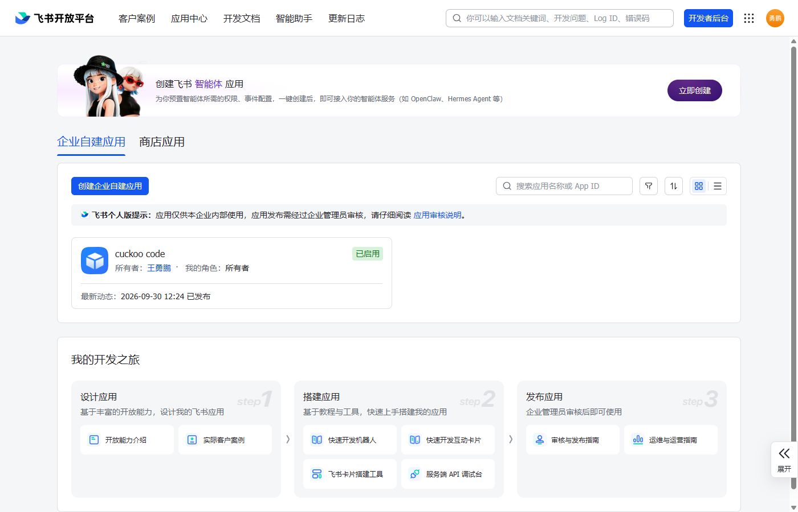
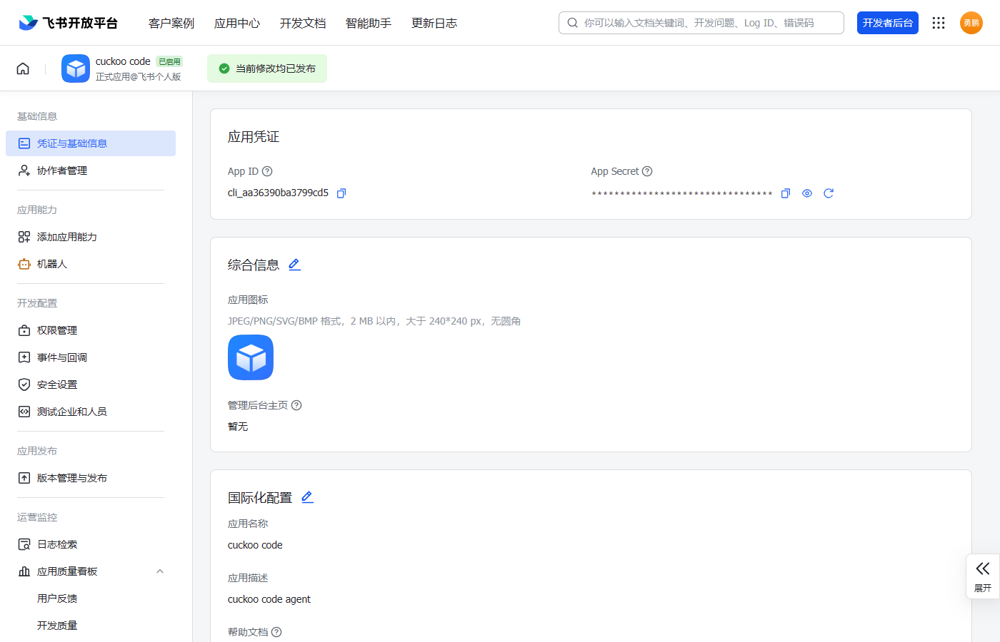
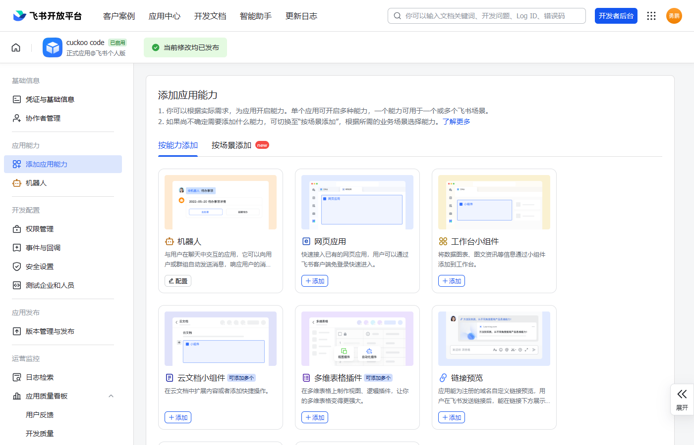
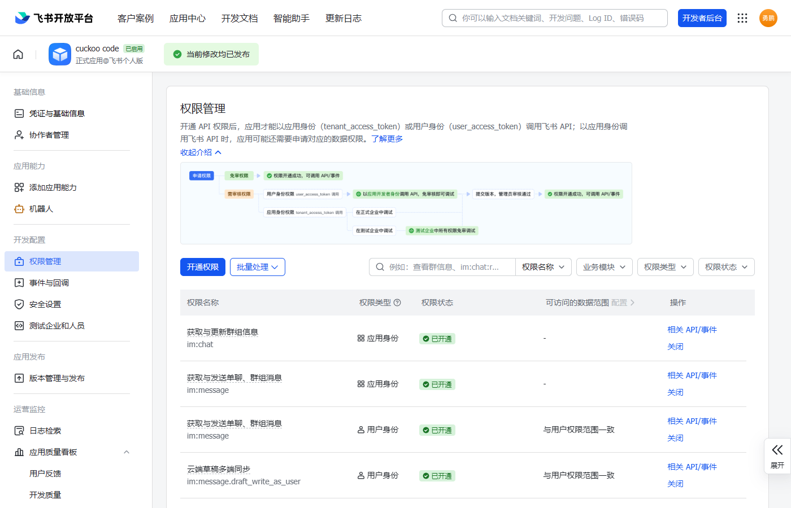
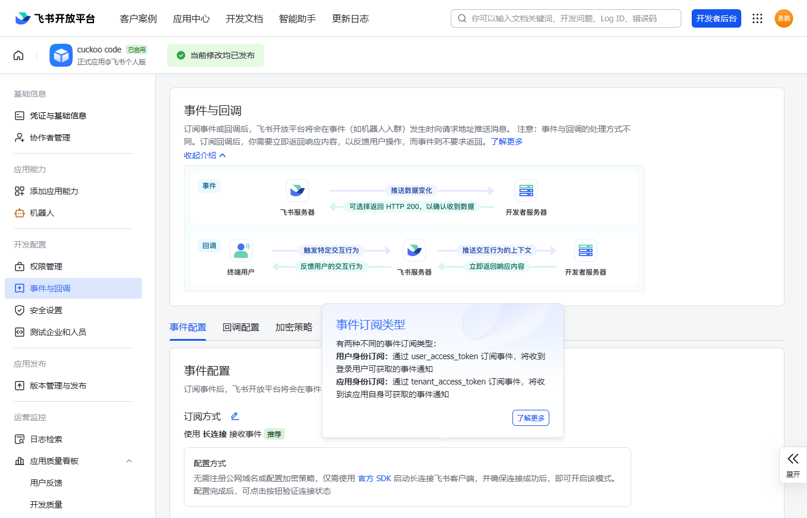
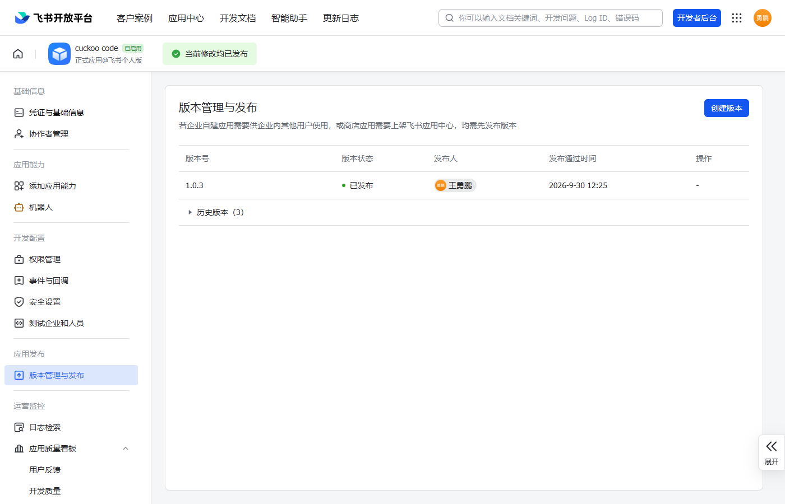

# 飞书同步配置指南（图文）

> 本文档手把手教你配置飞书机器人，让 **手机飞书** 也能收发 Cuckoo Code 的对话。
> 全程约 **10 分钟**，只需要一个飞书账号（免费）。

---

## 目录

1. [注册飞书账号](#1-注册飞书账号)
2. [创建"企业自建应用"](#2-创建企业自建应用)
3. [获取 App ID / App Secret](#3-获取-app-id--app-secret)
4. [添加"机器人"能力](#4-添加机器人能力)
5. [开通权限](#5-开通权限)
6. [配置事件订阅（关键！）](#6-配置事件订阅关键)
7. [发布应用](#7-发布应用)
8. [在 Cuckoo 里填写凭证](#8-在-cuckoo-里填写凭证)
9. [在飞书里给机器人发消息](#9-在飞书里给机器人发消息)
10. [完成！](#10-完成)

---

## 1. 注册飞书账号

1. 打开 **https://www.feishu.cn/** → 注册（手机号即可，免费）
2. 注册时会让你**创建一个组织/团队**（随便起名，个人可用，不需企业认证）

---

## 2. 创建"企业自建应用"

1. 打开 **https://open.feishu.cn/app** → 用刚注册的账号登录
2. 点「**创建企业自建应用**」
3. 填**应用名称**（如 `Cuckoo`）、图标随意 → **创建**

---

## 3. 获取 App ID / App Secret

1. 进入应用后，左侧「**凭证与基础信息**」
2. 复制这两个值（等下填进 Cuckoo）：
   - **App ID**（如 `cli_xxxxxx`）
   - **App Secret**（点「查看」）

---

## 4. 添加"机器人"能力

1. 左侧「**添加应用能力**」
2. 找到「**机器人**」→ 点「**添加**」

---

## 5. 开通权限

1. 左侧「**权限管理**」
2. 搜索并开通以下权限：
   - **`im:message`**（获取与发送单聊、群组消息）
   - **`im:message:send_as_bot`**（以应用身份发消息）
   - **`im:message.p2p_msg:readonly`**（读取用户发给机器人的单聊消息）

---

## 6. 配置事件订阅（关键！）

> ⚠️ **这是最容易漏的一步**。配错会导致"能发不能收"。

1. 左侧「**事件与回调**」→ 选「**事件配置**」
2. **订阅方式** → 选「**使用长连接接收事件**」（⚠️ **不是**"发送到开发者服务器"）→ 点「**保存**」
3. 「**已添加事件**」→ 点「**添加事件**」→ 搜「**接收消息**」→ 添加 **`im.message.receive_v1`**

> 💡 长连接的好处：**不需要公网 IP、不需要服务器**，普通电脑直接可用。

---

## 7. 发布应用

1. 左侧「**版本管理与发布**」
2. 点「**创建版本**」→ 填版本号（如 `1.0.0`）→「**申请发布**」
3. 你是管理员 → **审批通过**（秒过）

> ⚠️ **改了上面任何配置，都要重新创建版本 + 发布**，否则不生效！

---

## 8. 在 Cuckoo 里填写凭证

1. 打开 Cuckoo Code，点左侧活动栏的「**飞书**」图标（气泡）
2. 填入 **App ID** 和 **App Secret**
3. 打开「**启用飞书同步**」开关
4. 点「**保存并连接**」
5. 状态应变「**已连接**」（绿点）

---

## 9. 在飞书里给机器人发消息

> ⚠️ **必须做这一步**，否则 Cuckoo 不知道把消息发给谁。

1. 打开**飞书 App**（手机/电脑）
2. 搜索你的应用名（如 `Cuckoo`）→ 进入对话
3. **发一条消息**（如"你好"）
4. 回 Cuckoo 飞书页 →「**推送目标**」应变「**已记录**」

> 如果**没有输入框**：确认第 6 步「事件订阅」配好、第 7 步已发布、应用「可用范围」包含你自己。

---

## 10. 完成！

现在：

| 操作 | 效果 |
|---|---|
| Cuckoo 里发消息 | 飞书收到「👤 我：xxx」 |
| AI 回复 | 飞书收到「🤖 AI：xxx」（纯对话） |
| AI 调用工具 | 飞书收到「🔧 调用中 / ✅ 完成」 |
| **在飞书发消息** | **Cuckoo 当前窗口发给 AI** |

---

## 常见问题

### Q: 状态一直"连接中"？
- 检查 App ID / App Secret 是否正确
- 检查第 6 步「订阅方式」是否选了「使用长连接」

### Q: 飞书收不到消息？
- 检查第 9 步是否**在飞书里给机器人发过消息**（记录推送目标）
- 检查「推送目标」是否显示「已记录」

### Q: 找不到机器人 / 没有输入框？
- 检查第 6 步「事件订阅」是否配了 `im.message.receive_v1`
- 检查第 7 步是否**已发布**
- 检查应用「可用范围」是否包含你自己

### Q: 改了配置不生效？
- **必须重新创建版本 + 发布**（第 7 步）

---

*本文档由 Cuckoo Code 生成。*
